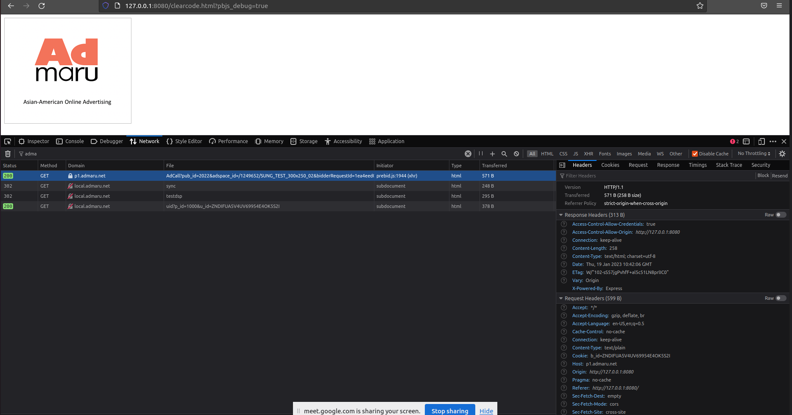
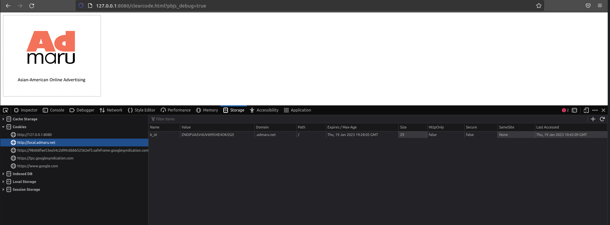

# UserSync service

## How to run

1. Requirements:

- Node.js
- npm

2. Install required dependencies:

```
npm install
```

3. Run the service:

```
npm start
```

## Endpoints

- `/UserSync/uid`

This endpoint takes `u_id` from query params and sends a response with cookie (`b_id`) attached in the header. This cookie has `domain` set to `admaru.net` and `maxAge` to `31556926` (1 year).

- `/UserSync/sync`

This endpoint redirects to the dsp cookie generation endpoint which should redirect to `/UserSync/uid` with `u_id` in the query params. This endpoint's purpose is to allow changing dsp urls without rebuilding prebid.js

- `/testdsp`

Used for testing purposes

## Turning on HTTPS

To turn on HTTPS server, you need to specify the cert path in `.env` file (by default this line is commented).

## Screenshots

- request with cookie



- cookie on `admaru.net` domain


